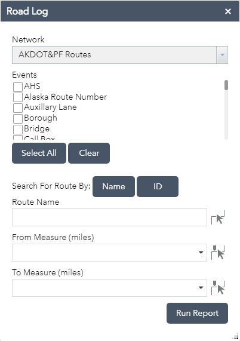

# Road Log widget
The Road Log widget allows you to interactively generate a log report of events along a particular route.

## Sections

* [Features](#features)
* [Requirements](#requirements)
* [Instructions](#instructions)
* [Resources](#resources)

## Features

* Automatically detect a linear referencing enabled map service in the webmap
* Dynamically segment events on a route

## Requirements

* Web AppBuilder for ArcGIS version 2.6

## Instructions
Deploying Widgets

To use the widget with Web AppBuilder, you should copy the RoadLog folder to the stemapp/widgets directory. This is located in %webappbuilder_install%/client directory.

For more resources on developing or modifying widgets please visit
[Web AppBuilder for ArcGIS Documentation](https://developers.arcgis.com/web-appbuilder/)

## Resources

* [Web AppBuilder API](https://developers.arcgis.com/web-appbuilder/api-reference/css-framework.htm)
* [ArcGIS API for JavaScript](https://developers.arcgis.com/javascript/)
* Learn more about [Esri Roads and Highways for Server](https://server.arcgis.com/en/roads-highways/)
* Learn more about [ArcGIS Pipeline Referencing for Server](https://server.arcgis.com/en/pipeline-referencing/)